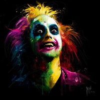
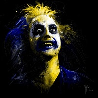
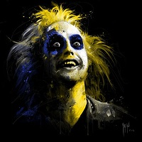
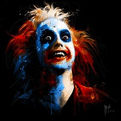

# Daltonizing images with Octave / Matlab
This project tries to perform the correct transformations to a given image to show how a colorblind person would see the image. There are several types of colorblind based on the human eye cones sensitivity are partially damaged or missing at all. In this project I will focus on:
* __Protanopia:__ Defective long-wavelength cones (L-cones)
* __Deuteranopia:__ Defective medium-wavelength cones (M-cones)
* __Tritanopia:__ Defective short-wavelength cones (S-cones)


## How it works
To perform the transformation we need to change the image space from RGB to LMS. We need to do this because the LMS system is the one which represents the human eye cones and, which are responsible of color awareness or blindness, and with this representation, we perform the changes to the image and then convert it right back.

To change the color space from RGB to LMS we need to pass through the XYZ color space, and then change it to LMS, so the math behind this is the following:
```matlab
[X, Y, Z] = [M] * [R, G, B]
```
Where M is the transformation matrix from RGB to XYZ. There are many of transformation matrices, which can be found [here](http://www.brucelindbloom.com/index.html?Eqn_RGB_XYZ_Matrix.html). 

Then, we need to change the color space from XYZ to LMS, performing the following transformation:
```matlab
[L, M, S] = [N] * [X, Y, Z]
```
Again, N is a transformation matrix, which can be changed depending on the system you are working. [Here](https://en.wikipedia.org/wiki/LMS_color_space#XYZ_to_LMS) is a list of them

After this we need to get the transformation matrix between the original, full color LMS space to the colorblind LMS_x space. In order to change from LMS to LMS with protanopia, we can't just delete the L cone. We need to calculate the change of color awareness in the rest of the cones. The full theoretical mathematics process is developed [here](doc/project_report.pdf).

In our case, because the reference systems can be customized, I cannot use the original transformation matrix from LMS to LMS_protanopia and so on, because the original values depends on the transformation matrices chosen. Because of this, we need to calculate these transformation matrices.

Finally, once we have all the needed matrices, we can perform the transformation. Now we just iterate through every pixel, transform it from RGB to LMS space, perform the change from full LMS space to the colorblind LMS_x space and then revert it back to RGB.

## Colorblind Color Spectrums
### Protanopia Color Spectrum
Protans have either defective long-wavelength cones (L-cones) or the L-cones are missing at all. If they are missing it is called protanopia or sometimes red-dichromacy. Affected persons are dichromats because they have only two working cone types, short- and medium-wavelength, compared to persons with normal vision with three different cone types.


### Deuteranopia Color Spectrum
Deuteranopia (also called green-blind). In this case the medium wavelength sensitive cones (green) are missing at all. A deuteranope can only distinguish 2 to 3 different hues, whereas somebody with normal vision sees 7 different hues.


### Tritanopia Color Spectrum
People affected by tritanopia are dichromats. This means the S-cones are completely missing and only long- and medium-wavelength cones are present.


## Execution example
* __RGB to XYZ transformation:__ [Wide Gamut RGB](https://en.wikipedia.org/wiki/Wide-gamut_RGB_color_space)
* __XYZ to LMS transformation:__ [CIECAM02](https://en.wikipedia.org/wiki/CIECAM02)

Source Image:




__Code__
```matlab
daltonize('example_images/beetlejuice.jpeg', 'wide_gamut_rgb', 'ciecam02');
```

Protanopia | Deuteranopia | Tritanopia
:-------------------------:|:-------------------------:|:-------------------------:
 |  | 

## Code optimization
After few tweaks, the performance of the script is really impressive, for example:
* __beetlejuice.jpeg (200\*200 px)__ Elapsed time is 0.026247 seconds.
* __landscape.jpg (2880\*1800 px)__ Elapsed time is 3.02334 seconds.

## Acknowledgments
* [Intelligent modification for the daltonization process of digitilized paintings](http://biecoll.ub.uni-bielefeld.de/volltexte/2007/52/pdf/ICVS2007-6.pdf)
* [Python implementation](https://github.com/joergdietrich/daltonize)
* [Android SDK daltonizer C++ implementation](https://android.googlesource.com/platform/frameworks/native/+/14e8b01/services/surfaceflinger/Effects/Daltonizer.cpp)
* [List of RGB to XYZ matrices](http://www.brucelindbloom.com/index.html?Eqn_RGB_XYZ_Matrix.html)
* [List of XYZ to LMS matrices](https://en.wikipedia.org/wiki/LMS_color_space)
